# Persistent Port VM Multiple Interface Configurations

Written by Ramon Grullon

A default gateway is a network device or node in a computer network that serves
as an entry and exit point for data traffic flowing to and from other networks.
It is a routing device that enables communication between devices within the same
local network and devices on external networks, such as the internet.

In summary, the default gateway is a fundamental component of network
communication, allowing devices within a local network to access external
networks, including the internet. It plays a crucial role in routing data between
different networks, ensuring proper communication and connectivity.

## The Right Way to Do It (Private with Gateway) Floating for (NAT/SNAT)

- Configure a private interface with a gateway.

- Launch an Instance:

  - Navigate to "Compute" > "Instances" in the left menu.

Click on the "Launch Instance" button.

- Instance Details:

  - Fill in the basic details for your instance:

    - Name: Enter a name for your instance.

    - Source: Choose your desired image.

    - Flavor: Choose an appropriate flavor.

    - Instance Count: Set the number of instances you want to launch to 1.

    - Instance Boot Source: Choose "Boot from image."

- Access & Security:

  - Configure security settings:

    - Key Pair: Select a key pair if you have one.

    - Security Groups: Choose appropriate security groups.

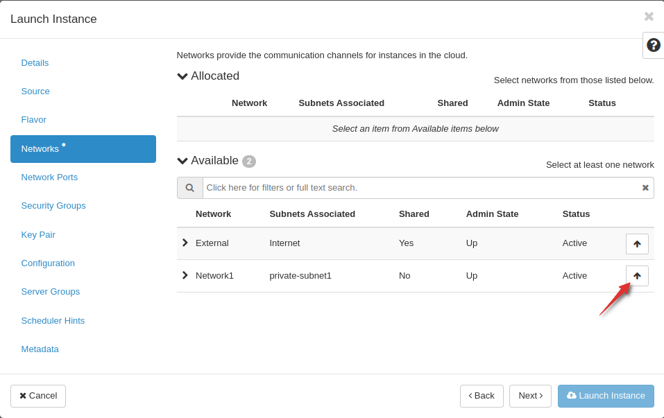

- Networking:

  - Under "Network Interfaces," select the network where you want to attach the instance.

- Review and Launch:

  - Review your configuration on the summary page.

  - Click "Launch" to create the instance.

- Instance Status:

  - Once the instance is launched, navigate to "Compute" > "Instances" to see
  the status of your instance.

  - Verify that the instance has a single port attached to the selected network.

- Access the Console (Optional):

  - If needed, access the console of the instance to configure networking setting

Add a floating IP for external access


SSH into the instance with the public floating IP and run IP route.

```bash
ubuntu@test1:~$ ip route
default via 192.168.0.1 dev ens3 proto dhcp src 192.168.0.147 metric 100 
169.254.169.254 via 192.168.0.101 dev ens3 proto dhcp src 192.168.0.147 metric 100 
192.168.0.0/24 dev ens3 proto kernel scope link src 192.168.0.147 

```

In summary, the private interface with its associated gateway facilitates
controlled communication between internal and external networks, enabling
internet access and centralized management. Simultaneously, keeping additional
ports/networks without a gateway is crucial for network isolation, security, and
flexibility in designing custom network configurations. Both aspects contribute
to creating a well-architected and secure network environment.

## Direct External (No Floating IP) + Private with No Gateway

### Secondary Network without Gateway

- Configure a direct external interface on 1 instance

- Configure a private interface without a gateway and without a gateway on
multiple networks on 2 separate instances

- Create a Network:

  - Navigate to "Network" > "Networks" in the left menu.

  - Click on the "Create Network" button.

- Network Details:

  - Fill in the details for your network:

    - Name: Enter a name for your network.

    - Project: Choose the project for which you want to create the network.

    - Network Address: Specify the network address in CIDR notation (e.g., 192.168.1.0/24).

    - Enable DHCP: Disable DHCP as you won't have a gateway.

- Subnet Details:

  - Click on "Subnet" to add a subnet to the network.

    - Name: Enter a name for your subnet.

    - Network Address: Specify the subnet address in CIDR notation (e.g., 192.168.1.0/24).

    - Gateway IP: Leave this field blank since you don't want a gateway.

    - Disable DHCP: Disable DHCP for this subnet.

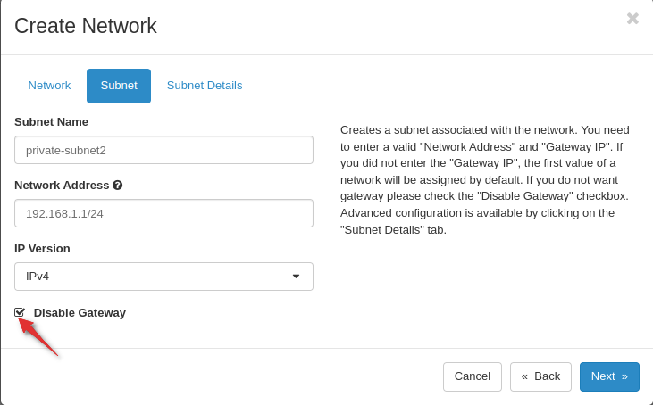
 Review and Create

Review your configuration on the summary page.

Click "Create" to create the network.

- Verify the Network:

  - Navigate to "Network" > "Networks" to see the newly created network.

  - Ensure that the network does not have a gateway IP associated.

First to explain how these two approaches work and their differences

Multi-port address pairs and multi-port policy-based routing are two different
concepts in networking, each serving specific purposes. Let's discuss each concept.

## Comparison between Multi-Port Address Pairs and Multi-port Policy-Based Routing

### Multi-Port Address Pairs

#### Definition of Address Pairs

- Address Pairs: In networking, an address pair refers to associating multiple
IP addresses with a single network interface.

#### Use Case for Address Pairs

Floating IPs: In OpenStack a floating IP is an IP address that can be dynamically
reassigned to different instances, providing high availability and failover capabilities.

#### Benefits of Address Pairs

- High Availability: Enables instances to quickly recover from failure by
associating a new IP address.

- Load Balancing: Allows for distributing traffic across multiple instances.

### Multi-Port Policy-Based Routing

#### Definition of PBR

- Policy-Based Routing (PBR): A technique in networking where routing decisions
are based on policies defined by administrators rather than the traditional
routing table.

#### Use Case for PBR

- Custom Routing Decisions: Policy-based routing allows administrators to define
 rules or policies that determine the route traffic takes based on specific
 criteria, such as source IP, destination IP, or type of service.

#### Benefits of PBR

- Flexible Routing Decisions: Provides flexibility in determining how traffic is
 routed based on various criteria.

- Traffic Engineering: Enables optimization of network paths based on specific requirements.

### Comparison

- Purpose:

  - Address Pairs: Primarily used for high availability and load balancing,
  especially in cloud environments.

  - Policy-Based Routing: Used to customize routing decisions based on policies
  defined by administrators.

- Scope:

  - Address Pairs: Generally associated with a specific network interface on an
  individual device.

  - Policy-Based Routing: Affects the entire routing decision process on a device.

- Granularity:

  - Address Pairs: Operates at the level of individual IP addresses associated
  with a network interface.

  - Policy-Based Routing: Allows for complex routing decisions based on various criteria.

- Example Scenarios:

  - Address Pairs: Floating IP scenarios in cloud environments where IP addresses
   can be dynamically reassigned.

  - Policy-Based Routing: Implementing specific routing policies, such as sending
   traffic from a particular source through a specific gateway.

In summary, multi-port address pairs are focused on associating multiple IP
addresses with a single network interface for specific use cases like floating
IPs, while multi-port policy-based routing allows administrators to customize
routing decisions based on defined policies. The choice between them depends
on the specific networking requirements and goals of a given scenario.

## Multi-IP Single Port (Address Pairs) Solution

### Cloud Admin

Allocated 2 Floating IPs to desired Project.

### Cloud Tenant

Create 2 ports prior to the creation of your instance.

In Horizon, Go to Network - Networks - Ports and Create a port


Configure 2 ports with distinct names and set them to the subnet and security
group desired

(Keep in mind, you must have your network and subnet configured prior to this step.)

Note: This is necessary to allow


When creating a port, allocate the correct Security Groups to the port.


Create an instance making sure to select the correct network ports.

Select all the ports you previously created.


Due to issues with ip routing during creation caused by the multiple ports,
 cloud-init is unable to inject your SSH key. **You must select the configuration
 drive** to enable OpenStack to add your SSH key.

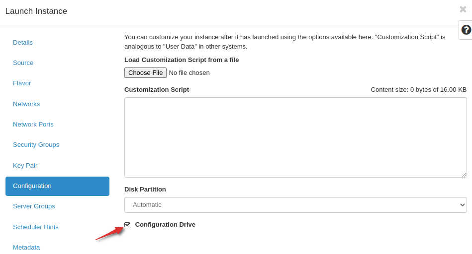

In order to configure multi-port networking, you must identify which port is
designated as the default route interface. You can view the console log on
Horizon and look at the routing table configuration as the instance is created.

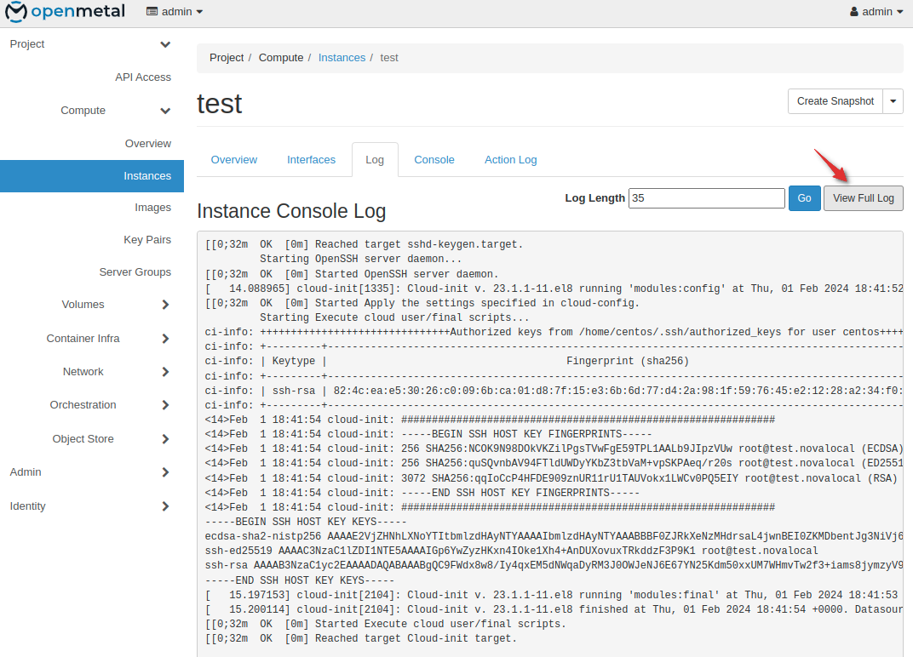

The console log will display a network device table which you will use to
correlate the interface that is the default gateway to its IP address.


The console log will display a routing table where the interface representing
Route 0 is the default gateway. In this example, eth0 is the default gateway.
Looking at the network device table from above, its IP address is 192.168.3.170


Go to Network - Networks - Your Subnet - Ports

Identify the port associated with the IP address of the default gateway identified
earlier. In this case, it’s port1

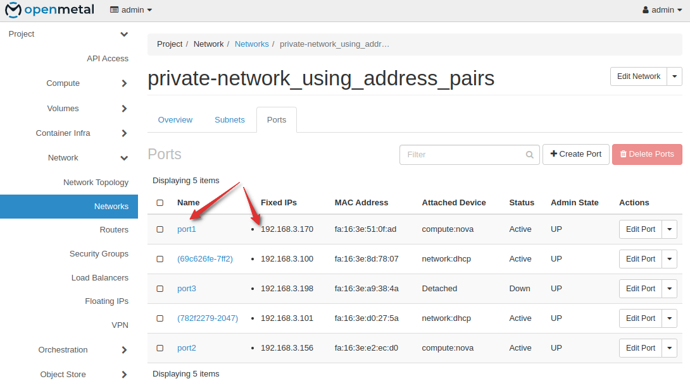

Click on the port - “Allowed Address Pairs” tab - Add Allowed Address Pair

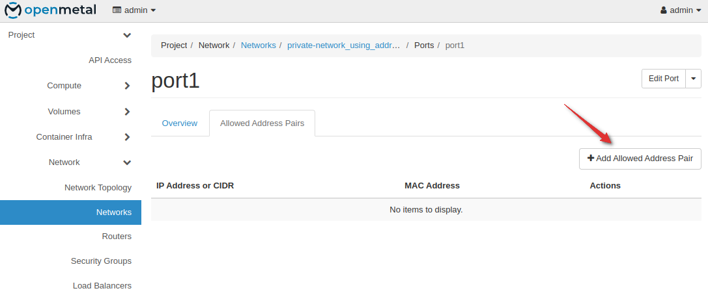

The corresponding IP addresses of the other 2 ports to the allowed addresses.
In this case, 192.168.3.156

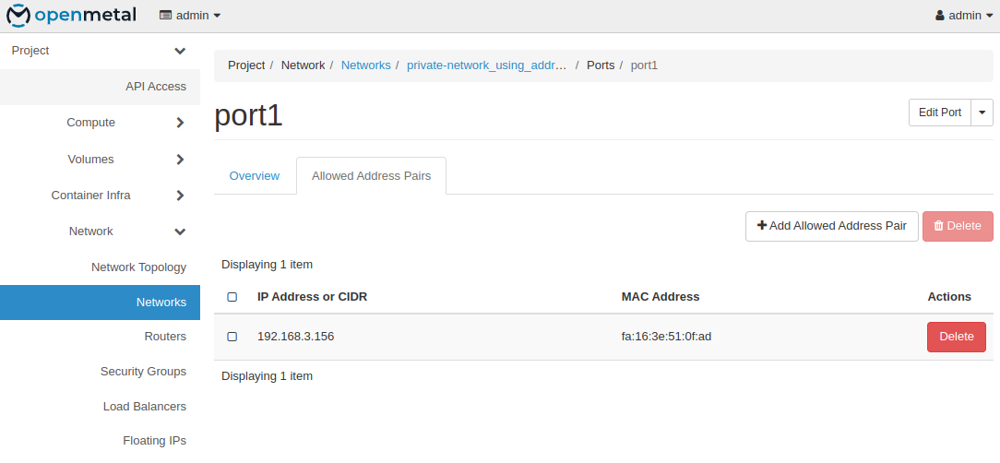

In order to test this, I will add floating IPs to each of the two ports and
confirm I can SSH into the instance through all 2 IPs.


You can run the following curl command from inside your instance to confirm
successful completion of your multi-port setup. This will curl through each port
to <https://ifconfig.me> and return your publicly accessible IP address.

```bash
curl --interface eth0 ifconfig.me; echo

curl --interface eth1 ifconfig.me; echo
```

## Multiple Internal Interfaces with Gateways & Floating IPs & Policy-Based

Table Reconfiguration

### Cloud Admin Pre-Req

Allocated 2 Floating IPs to desired Project.

### Cloud Tenant Pre-Req

#### VM creation

Create a VM attaching the desired subnet. (In this example we are using 192.168.0.0/24)

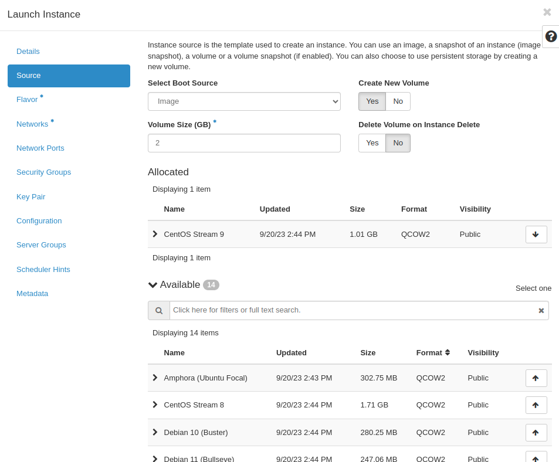

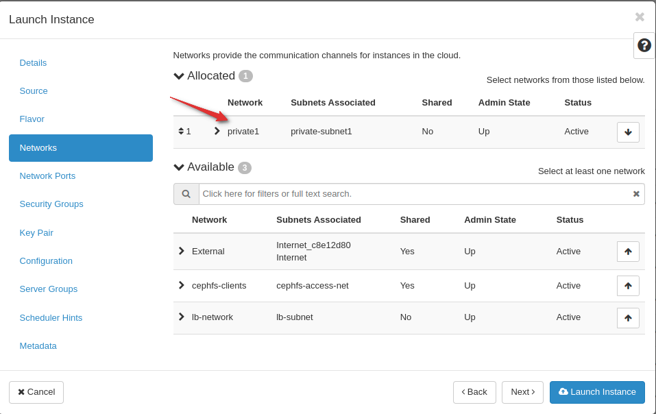

Attach a floating IP and confirm you can access the VM through SSH.

#### Port Creation

Create a new port in the same subnet.

In Horizon, Go to Network - Networks - Select your network - Ports and Create a port

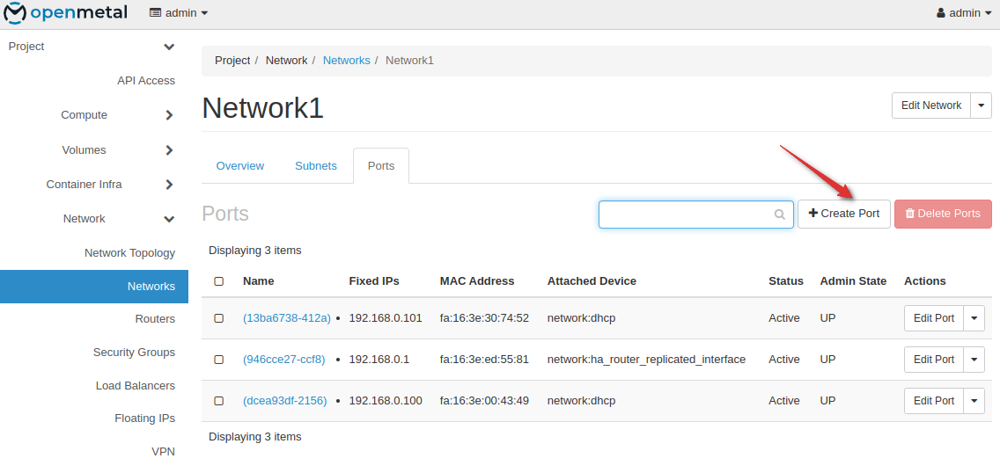

Configure a secondary port with a distinct name and set the port to the subnet
and security group desired.

### ***Note: The below step is not required in RHEL distributions**

dhclient, provides a means for configuring one or more network interfaces using
the DHCP to request an IP from a DHCP server.

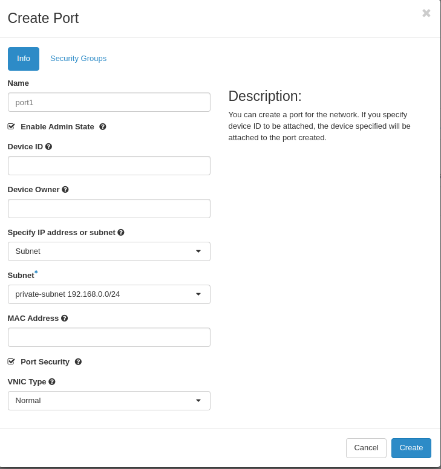

When creating a port, allocate the correct Security Groups to the port.

Note: Security Groups must be set for each port to allow external access.


#### Attach Port

Go to Instances - and attach the new port to the instance you created initially.

**Note: Make sure by Port on the option on how to specify an interface.**

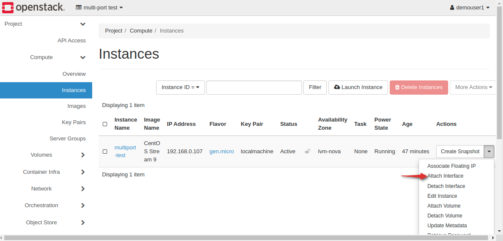

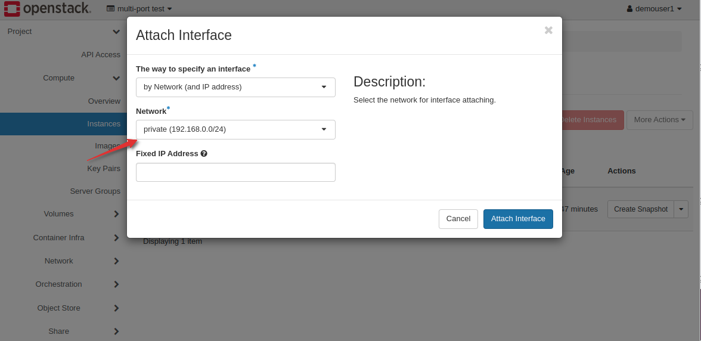


Attach a floating IP to this new port. Your instance will now have 4 distinct IPs


#### Configure Policy Based Routing

##### SSH to your instance

For context, every machine can only have 1 default gateway out of the box but
since we have 2 separate interfaces which by design have a default gateway
defined in IP route, the interface with the lower metric is assigned by the
system to send all traffic out. This means any traffic meant for the secondary
interface will fail such as ICMP pings.

### **Sending traffic to 1st interface created**

External packet (ICMP Ping) - Floating IP - Internal IP (eth0) - Pong -
Check IPRoute - This IP route has the lowest metric and is used

```bash
default via 192.168.0.1 dev eth0 proto dhcp src 192.168.0.107 metric 100
```

Then you send traffic out dev eth0 - Floating IP - External IP (Success)

### **Sending traffic to Secondary interface created**

External packet (ICMP Ping) - Floating IP - Internal IP (eth1) - Pong -
Check IPRoute - This IP route has the lowest metric and is used

```bash
default via 192.168.0.1 dev eth0 proto dhcp src 192.168.0.107 metric 100
```

Then you send traffic out dev eth0 - Floating IP (No route to host) -
External IP (Failure)

```bash
[cloud-user@multiport-test ~]$ ip route
default via 192.168.0.1 dev eth0 proto dhcp src 192.168.0.107 metric 100 
default via 192.168.0.1 dev eth1 proto dhcp src 192.168.0.112 metric 101 
169.254.169.254 via 192.168.0.100 dev eth0 proto dhcp src 192.168.0.107 metric 100 
169.254.169.254 via 192.168.0.100 dev eth1 proto dhcp src 192.168.0.112 metric 101 
192.168.0.0/24 dev eth0 proto kernel scope link src 192.168.0.107 metric 100 
192.168.0.0/24 dev eth1 proto kernel scope link src 192.168.0.112 metric 101 

```

To assign each interface to utilize a specific default gateway, we must create a
secondary IP route table with rules for our secondary

#### Create a new IP route table

```bash
cloud-user@multiport-test ~]$sudo bash
cloud-user@multiport-test ~]$echo "1 port2" >> /etc/iproute2/rt_tables
```

Add IP routes to the new IP route table “port2” and delete secondary interface
routes from the primary IP route table. Run IP route and copy, paste the entries
with eth1(secondary interface) for ease of use during this process.

#### ADD ROUTES TO NEW TABLE

```bash
[root@multiport-test cloud-user]# ip route add default via 192.168.0.1 dev eth1 proto dhcp src 192.168.0.112 metric 101 table port2
[root@multiport-test cloud-user]# ip route add 169.254.169.254 via 192.168.0.100 dev eth1 proto dhcp src 192.168.0.112 metric 101 table port2
[root@multiport-test cloud-user]# ip route add 192.168.0.0/24 dev eth1 proto kernel scope link src 192.168.0.112 metric 101 table port2
```

#### DELETE THE ENTRIES FROM YOUR MAIN IP ROUTING TABLE

```bash
[root@multiport-test cloud-user]# ip route del default via 192.168.0.1 dev eth1 proto dhcp src 192.168.0.112 metric 101
[root@multiport-test cloud-user]# ip route del 169.254.169.254 via 192.168.0.100 dev eth1 proto dhcp src 192.168.0.112 metric 101 
[root@multiport-test cloud-user]# ip route del 192.168.0.0/24 dev eth1 proto kernel scope link src 192.168.0.112 metric 101 
```

#### YOUR 2 ROUTING TABLES SHOULD LOOK SIMILAR TO THIS

```bash
[root@multiport-test cloud-user]# ip route
default via 192.168.0.1 dev eth0 proto dhcp src 192.168.0.107 metric 100 
169.254.169.254 via 192.168.0.100 dev eth0 proto dhcp src 192.168.0.107 metric 100 
192.168.0.0/24 dev eth0 proto kernel scope link src 192.168.0.107 metric 100 
```

```bash
[root@multiport-test cloud-user]# ip route list table port2
default via 192.168.0.1 dev eth1 proto dhcp src 192.168.0.112 metric 101 
169.254.169.254 via 192.168.0.100 dev eth1 proto dhcp src 192.168.0.112 metric 101 
192.168.0.0/24 dev eth1 proto kernel scope link src 192.168.0.112 metric 101 
```

##### Add rules for new IP routing table

In our example we have both interfaces utilizing the same subnet, therefore we
must set a static IP(This is .112 which we assigned to eth1) in our rules to use
our secondary routing table anytime traffic is entering or exiting the VM for
our secondary interface.

Add these rules to your secondary table specifying your specific IP

```bash
ip rule add from 192.168.0.112/32 lookup port2
ip rule add oif eth1 table port2
ip rule add iif eth1 table port2
```

#### Testing configuration

Ping test

```bash
ping -I eth0 192.168.0.1
ping -I eth1 192.168.0.1
```

Confirm with tcpdump - Run the ping command and open a new session with tcpdump
installed and the output expected -

```bash
[cloud-user@multiport-test ~]$ sudo tcpdump -nni eth1 icmp
dropped privs to tcpdump
tcpdump: verbose output suppressed, use -v[v]... for full protocol decode
listening on eth1, link-type EN10MB (Ethernet), snapshot length 262144 bytes
17:56:27.898382 IP 192.168.0.112 > 192.168.0.1: ICMP echo request, id 3, seq 1, length 64
17:56:27.898992 IP 192.168.0.1 > 192.168.0.112: ICMP echo reply, id 3, seq 1, length 64
17:56:28.949107 IP 192.168.0.112 > 192.168.0.1: ICMP echo request, id 3, seq 2, length 64
17:56:28.949344 IP 192.168.0.1 > 192.168.0.112: ICMP echo reply, id 3, seq 2, length 64
17:56:29.973112 IP 192.168.0.112 > 192.168.0.1: ICMP echo request, id 3, seq 3, length 64
17:56:29.973245 IP 192.168.0.1 > 192.168.0.112: ICMP echo reply, id 3, seq 3, length 64
17:56:30.997126 IP 192.168.0.112 > 192.168.0.1: ICMP echo request, id 3, seq 4, length 64
17:56:30.997264 IP 192.168.0.1 > 192.168.0.112: ICMP echo reply, id 3, seq 4, length 64
17:56:32.021131 IP 192.168.0.112 > 192.168.0.1: ICMP echo request, id 3, seq 5, length 64
17:56:32.021314 IP 192.168.0.1 > 192.168.0.112: ICMP echo reply, id 3, seq 5, length 64
^C
10 packets captured
11 packets received by filter
0 packets dropped by kernel

```

Run curl command against ifconfig.me to confirm each interface is using itself
as its gateway

```bash
[cloud-user@multiport-test ~]$ curl --interface eth1 http://ifconfig.me; echo
173.231.253.221
[cloud-user@multiport-test ~]$ curl --interface eth0 http://ifconfig.me; echo
200.225.45.137

```

## (Bonus) Persistence - Ubuntu/RHEL

- Provide instructions for making network configurations persistent on Ubuntu.

- Provide instructions for making network configurations persistent on RHEL/CentOS.

In this process we will implement policy-based routing using systemd by creating
a systemd service unit that executes a script responsible for setting up the
required IP routes.

Persistent policy-based routing is often desirable in scenarios where specific
routing decisions need to persist across reboots or network restarts. Here are
some reasons why someone might want to implement persistent policy-based routing:

- Customized Routing Policies:

  - When there is a need for custom routing policies based on specific criteria
  such as source IP, destination IP, or type of service.

- Traffic Engineering:

  - To optimize network paths and direct traffic in a way that aligns with
  specific performance or security requirements.

- Multi-Homed Systems:

  - In situations where a system has multiple network interfaces connected to
  different networks, and the administrator wants to control how traffic flows
  through each interface.

- Load Balancing:

  - For load balancing scenarios where multiple paths exist, and administrators
  want to distribute traffic across those paths.

- High Availability and Failover:

  - In setups where there are redundant network paths, administrators can use
  persistent policy-based routing to implement failover mechanisms for improved
  network availability.

- Security and Isolation:

  - To create network segmentation and isolate traffic between different parts
  of a network, enhancing security.

- Specialized Services:

  - When a system provides specialized services and needs to route specific types
  of traffic through dedicated network paths.

- Consistent Network Configuration:

  - To maintain consistent network configurations across reboots, ensuring that
  the system operates with the desired routing behavior.

## Pre-requisites

- 2 interfaces configured with IPs address and floating IPs

- Secondary route table created in /etc/iproute2/rt_tables (Refer to VM Multiple
Interface Configuration with Policy Based Routing for further guidance)

## Context

Our initial ip route looks like this. We will be working with 2 interfaces with
2 IPs -

eth0 - 192.168.0.107 & eth1 - 192.168.0.112

```bash
[cloud-user@multiport-test ~]$ ip route
default via 192.168.0.1 dev eth0 proto dhcp src 192.168.0.107 metric 100 
default via 192.168.0.1 dev eth1 proto dhcp src 192.168.0.112 metric 101 
169.254.169.254 via 192.168.0.100 dev eth0 proto dhcp src 192.168.0.107 metric 100 
169.254.169.254 via 192.168.0.100 dev eth1 proto dhcp src 192.168.0.112 metric 101 
192.168.0.0/24 dev eth0 proto kernel scope link src 192.168.0.107 metric 100 
192.168.0.0/24 dev eth1 proto kernel scope link src 192.168.0.112 metric 101

```

## Procedure

Create a script (let's call it policy-routing.sh): I located my file in
/usr/bin/policy-routing.sh and make the file executable - chmod +x policy-routing.sh

```bash
#!/bin/bash
ip route add default via 192.168.0.1 dev eth1 proto dhcp src 192.168.0.112 metric 101 table port2
ip route add 169.254.169.254 via 192.168.0.100 dev eth1 proto dhcp src 192.168.0.112 metric 101 table port2
ip route add 192.168.0.0/24 dev eth1 proto kernel scope link src 192.168.0.112 metric 101 table port2
ip route del default via 192.168.0.1 dev eth1 proto dhcp src 192.168.0.112 metric 101
ip route del 169.254.169.254 via 192.168.0.100 dev eth1 proto dhcp src 192.168.0.112 metric 101 
ip route del 192.168.0.0/24 dev eth1 proto kernel scope link src 192.168.0.112 metric 101 
ip rule add from 192.168.0.112/32 lookup port2
ip rule add oif eth1 table port2
ip rule add iif eth1 table port2

```

This file will include the IP routes for your secondary routing table(in this
example called port2).

You will also remove the secondary interface eth1 IP routes from the main routing
table.

To finalize, you will add the IP rules for your routing table.

Create a systemd service unit file (e.g., /etc/systemd/system/policy-routing.service):

```bash
Unit]
Description=Policy-Based Routing Setup
After=network-online.target
Wants=network-online.target

[Service]
ExecStart=/bin/bash /usr/bin/policy-routing.sh

[Install]
WantedBy=multi-user.target

```

Make the script executable:

Reload systemd to pick up the changes:

dynamically enable and start the service for a specific interface, i.e. to
configure policy-based routing for `eth0` -

```bash
systemctl enable --now pbr@eth0.service
```

This will execute the script with the specified interface name and configure
policy-based routing accordingly.

Repeat the process for each interface you want to configure. Adjust the routing
commands in the script based on your specific requirements.

This file will execute the policy.sh script upon startup making sure to run after
the networking service has started.

After creating the unit file, reload systemd to pick up the changes:

```bash
systemctl daemon-reload
```

You can then enable and start the service:

```bash
systemctl enable policy-routing.service
systemctl start policy-routing.service
```

This setup will execute your script during the system startup, applying the
specified IP routes. Adjust the script and unit file according to your specific
requirements and paths.
