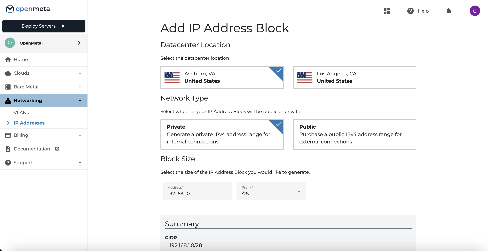
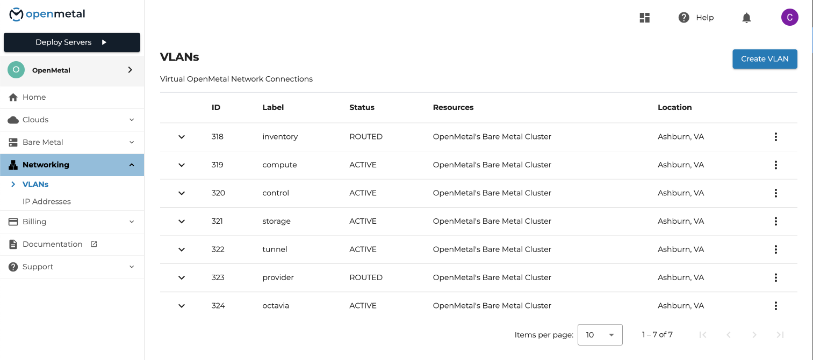
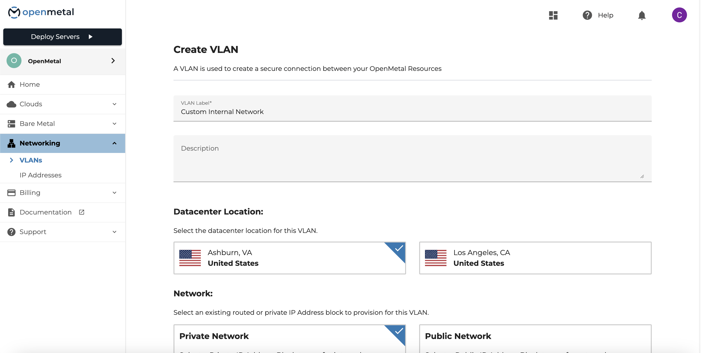
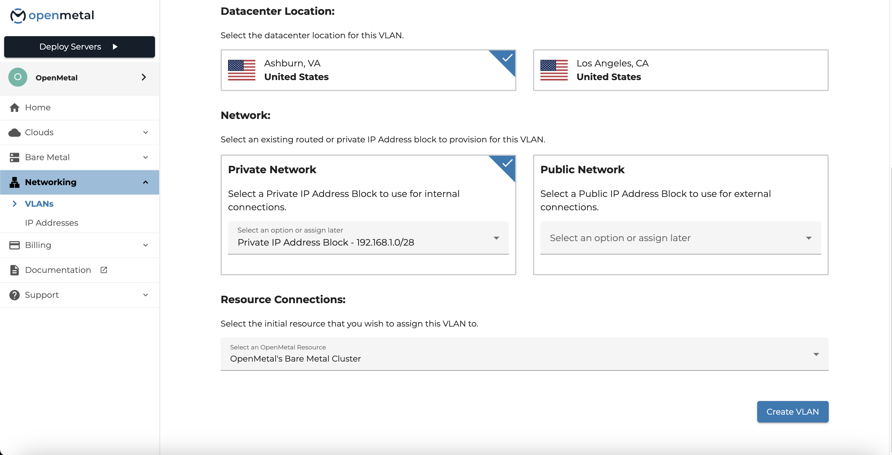
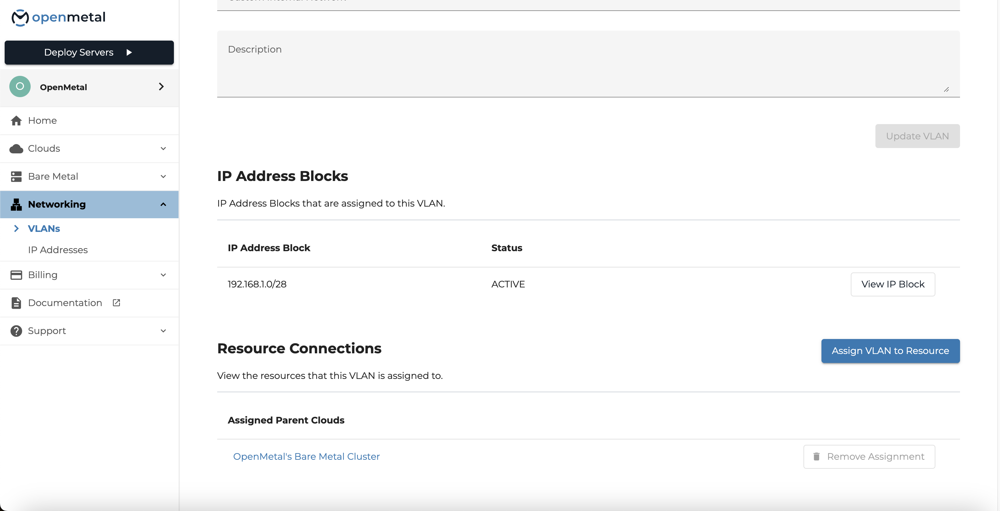
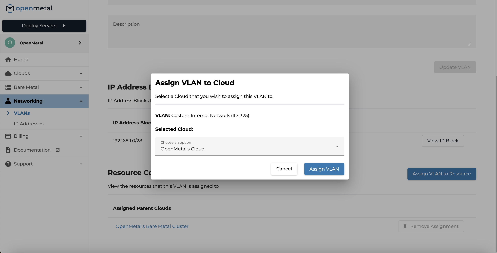
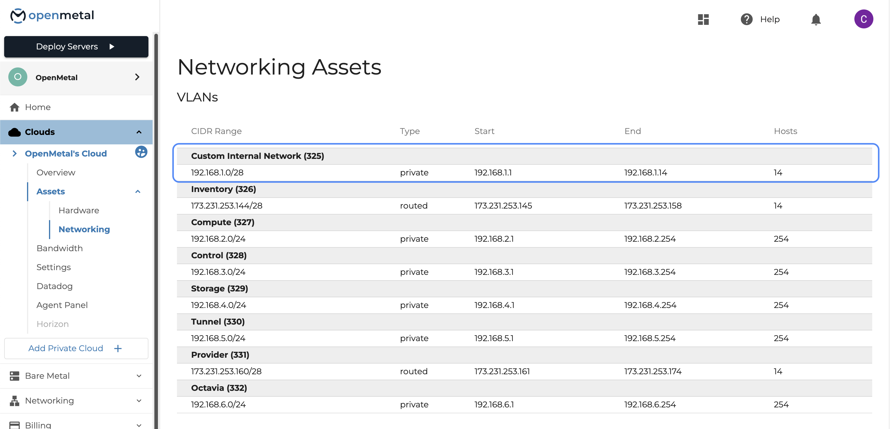

# Creating a Private Network Between Multiple Clusters

**Table of Contents:**

- [Creating a private VLAN](#creating-a-private-vlan)
    - [Create a Private IP Address Block](#create-a-private-ip-address-block)
    - [Create a Private VLAN](#create-a-private-vlan)
    - [Assign your VLAN to Multiple Clusters](#assign-your-vlan-to-multiple-clusters)
    - [Confirm VLAN Assignment](#confirm-vlan-assignment)
- [Confirm VLAN Assignment](#confirm-vlan-assignment)
    - [Confirm VLAN Assignment for Baremetal Cluster](#confirm-vlan-assignment-for-baremetal-clusters)
    - [Confirm VLAN Assignment for PCC Clouds](#confirm-vlan-assignment-for-pcc-clouds)
    
## Creating a private network

### Create a Private IP Address Block

In Central, navigate to the IP Addresses page from the Networking dropdown in the sidebar.  

From this page, select the **Add IP Addresses** button. 

On the IP Address Block Creation page:
1. Select the datacenter location that you wish to provision your IP Address Block in.
2. Select the Private Network Type to provision a private IP Address Block for internal connections only.
3. In the Block Size section input a valid Private IP Address to be used as the network address. These can be ones that follow the RFC1918 standard
    - The address should be within the following ranges
        - 172.16.0.0–172.31.255.255 
        - 10.0.0.0–10.255.255.255
        - 192.168.0.0–192.168.255.255 
4. Select a block size.  Valid options range from /21(2048 Addresses) to /32(One Address)

Verify the IP Address Block summary, and submit the IP Address Block creation request.

> **IP Address Allocation** - Prefixes created via Central will default to managed_addressing: "off", therefore IP Addresses will NOT be automatically assigned to cloud hosts from this IP Address Block 
{.is-info}

You should now see your newly created IP Address Block in the IP Addresses Table. This block will have no assigned IP Addresses and will not be assigned to a VLAN at this point. 

Proceed to the next step to assign this IP Address Block to your Provider network.

### Create a Private VLAN
Navigate to the Networking VLANs page via the sidebar in Central.

From the Networking VLANs page, select the **Create VLAN** button.

From the VLAN Creation Page:
1. Input a VLAN Label to identify your Internal Network.
2. Select a Datacenter Location.  This needs to match the location of your IP Address Block.
3. Select the Private Network Type.  
4. From the Private Network selection card, select your newly created Private IP Address Block.
5. From the Resource Connections selector, select the initial cluster that you wish to assign to this Internal Network.  You will assign this network to any additional clusters after the initial setup has complete.

Verify your selections and submit the VLAN Creation request.

Proceed to your Internal VLANs Dashboard in Central.

This page displays information pertinent to your newly created internal VLAN and should list any IP Address Blocks that are currently assigned to the VLAN as well as any clusters that the VLAN has been assigned to.  

Proceed to the next step to Assign your VLAN to Multiple Clusters.

### Assign your VLAN to Multiple Clusters
From the VLAN Modification page, select the **Assign VLAN to Resource** button in the Resource Connections section.

This a modal will display that identifies the current selected VLAN and allows your to select a cluster to assign this VLAN to.

Select an additional cluster that has yet to be assigned to the VLAN from the dropdown selector and complete the VLAN assignment request.  

The Assigned Parent Clouds section will include both clusters that this VLAN has been assigned to.

Proceed to the next section to confirm that VLAN assignment was successful for your cluster.

## Confirm VLAN Assignment

### Confirm VLAN Assignment for Baremetal Clusters
From Central, navigate to the Baremetal Cluster's Networking page.

This page will display all VLANs that have been assigned to the Baremetal Cluster and their associated IP Address Blocks.  This includes all system generated VLANs and any custom VLANs that may have been assigned to this resource.

Verify that your custom VLAN is listed in the VLANs table with the appropriate IP Address Blocks assigned.

### Confirm VLAN Assignment for PCC Clouds
From Central, navigate to the PCC Cloud's Networking Assets page.

This page will display all VLANs that have been assigned to the PCC Cloud and their associated IP Address Blocks.  This includes all system generated VLANs and any custom VLANs that may have been assigned to this resource.

Verify that your custom VLAN is listed in the VLANs table with the appropriate IP Address Blocks assigned.