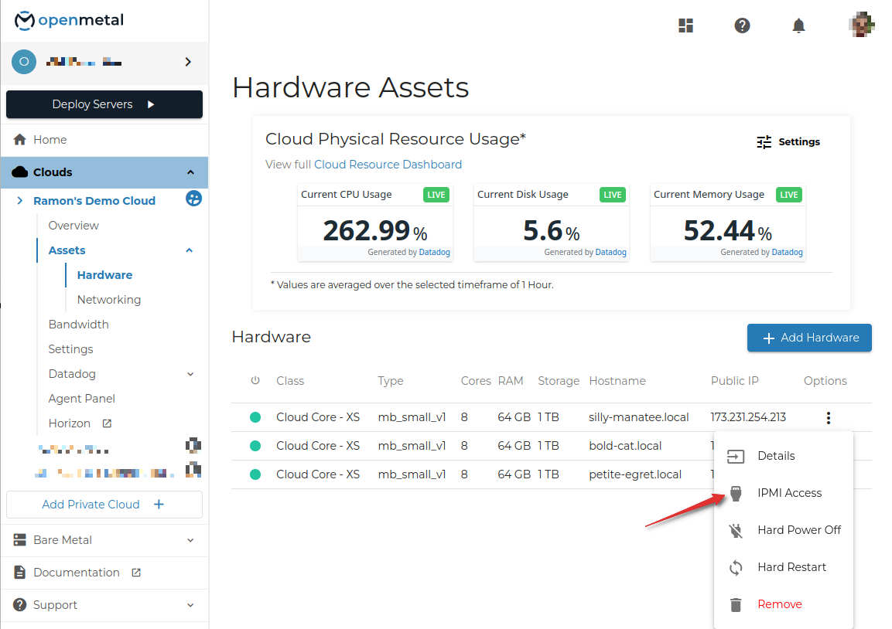
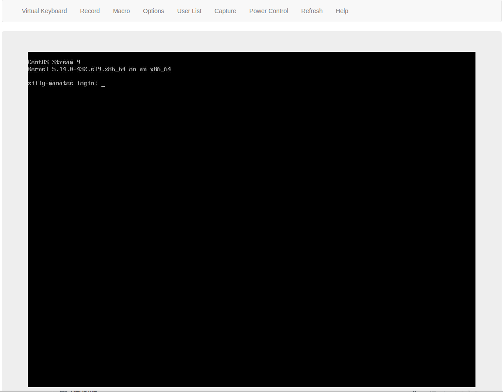

# Accessing IPMI on Central Dashboard

Author: Ramon Grullon

## Prerequisites

You have login credentials for the Central Dashboard.

## Step 1: Log In to the Central Dashboard

Open your preferred web browser and go to the URL of your Central Dashboard.
Enter your username and password.
Click Login.

## Step 2: Navigate to the Server's Asset Information

- Once logged in, locate and click on the Assets section from the main dashboard
menu.

- In the Assets page, your inventory of servers will be available. Find the
server you wish to manage.

- Click on the three dots on the right hand side next to the server to view more
information.

- Select the IPMI Access button

## Step 3: Select Access Type

- In the select access page, the default type utilized by OpenMetal is HTML5,

- Click the Open Web Console to continue

## Step 4: Handle Unsecured SSL Certificate Warning

If you encounter an SSL certificate warning, it’s typically because the server
is using a self-signed or untrusted certificate.

- Click on Proceed or Advanced (depending on your browser) to continue past the warning.

## Step 5: Access the Remote Console

After proceeding past the SSL warning, the IPMI HTML5 interface will load,
allowing you to interact with your server remotely.

You can now monitor the server, reboot, or perform any other remote management tasks.

