# Creating OpenStack VM Image with ISO

DESCRIPTION

## Prerequisites

- [OpenstackHorizon](../users-manual/using-creating-images.md)

## Preparation

In this article we will use ISOs to create 3 VM images: PFSense, 3CX, and Fedora

Using the following download and direction links

- [S3 client command](https://awscli.amazonaws.com/v2/documentation/api/latest/reference/s3/index.html)
- [r3CX install Debian](https://www.3cx.com/docs/manual/installing-debian-linux-pbx/)
- [3CX netinstall](https://downloads-global.3cx.com/downloads/debian12iso/debian-amd64-netinst-3cx.iso)

- [pfsense download](https://www.pfsense.org/download/)
- [pfsense iso](https://atxfiles.netgate.com/mirror/downloads/pfSense-CE-2.7.2-RELEASE-amd64.iso.gz)
(Extract the GZ file to get the ISO)

- [fedora download](https://fedoraproject.org/workstation/download)
- [fedora iso](https://download.fedoraproject.org/pub/fedora/linux/releases/39/Workstation/x86_64/iso/Fedora-Workstation-Live-x86_64-39-1.5.iso)

This method can be applied to a variety of Operating Systems.

## Upload ISOs to Cloud

First upload the ISO to your cloud / project. You can do this through Horizon,
or OpenStack CLI.

- [OpenstackHorizon](../users-manual/using-creating-images.md)

Uploading ISOs as the Admin user will allow you to share the ISO to be used by
all projects if selecting Public permissions.

### ISO Context of OpenStack

Imagine that provisioning a VM using an ISO, is like plugging in a Live USB/CD
into a computer. This computer does NOT have a hard drive, the storage is ON THE
USB. This is a very special relationship when running image based virtual
machines. The storage that is part of the VM flavor is attributed to the Image.
In fact the data of the ISO loads in as the volume if you create the ISO based
VM. Instead of a USB/CD-ROM, it’s a full blown computer, with CPU, RAM and
storage (ISO storage).

What we will want to do is create a Virtual Hard drive that we will install the
 OS onto. So create a volume. If you plan to reuse this image and the OS supports
cloud init, try to keep the volume to a minimal size, but if it cannot be
expanded later with cloud-init, set the appropriate storage size that you expect
to be utilized over the lifetime of the VM.


For large images Horizon will not let you upload large images through the UI.
You may need to use the CLI tool like so:

```bash
openstack image create --file Fedora-Workstation-Live-x86_64-39-1.5.iso --disk-format iso --shared --progress "Fedora Workstation Live 39"
[=============================>] 100%

openstack image create --file debian-amd64-netinst-3cx.iso.1 --disk-format iso --shared --progress "3cx-debian"
[=============================>] 100%

openstack image create --file pfSense-CE-2.7.2-RELEASE-amd64.iso --disk-format iso --shared --progress "pfsense"
[=============================>] 100%
```

## Images

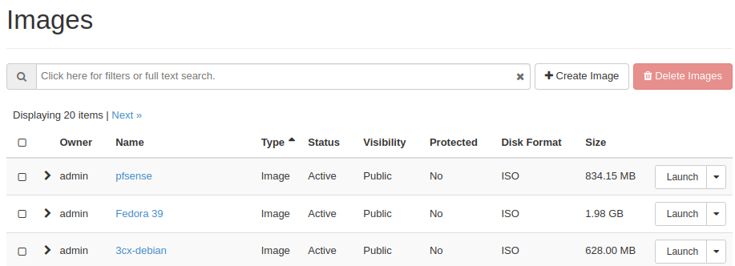

## Create ISO Virtual Machines

Understand that an ISO is technically just a ‘Drive’ that you can boot from, but
we need CPU and Memory to do that. So create a VM. There is no point to create a
volume from the ISO (It would be a direct copy of the contents of the ISO), we
want to run the Live CD/Installation Media from the image itself.

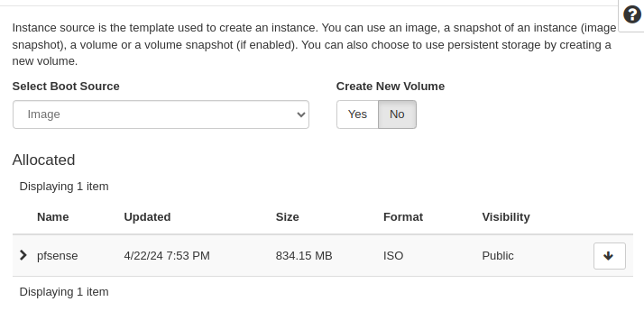

The flavor won’t matter either as these are just resources for the ISO and not
the future VM, pick something that will be powerful and fast.

Notice how I gave the VMs the name ISO-vm - this is to represent that these are
not real VM, this is just us running the ISOs:


## Create the Volumes (Drives to Install Software On)

Now we want to create the Virtual Disks (Bootable drives) that we will install
the ISOs onto:


Create the volumes

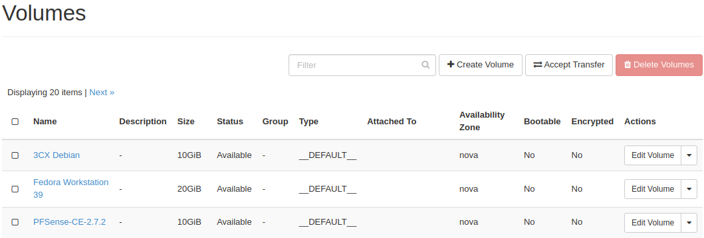

## Attach Volume to ISO VM

Now we want to attach the Volume (Drive) to the running ISO VMs, so that we can
later through the installers - install onto these drives.

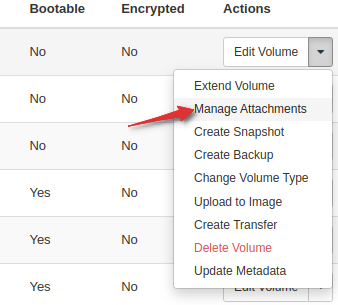

Now we have attached Empty unformatted volumes (Drives) to our respective ISO VMs.

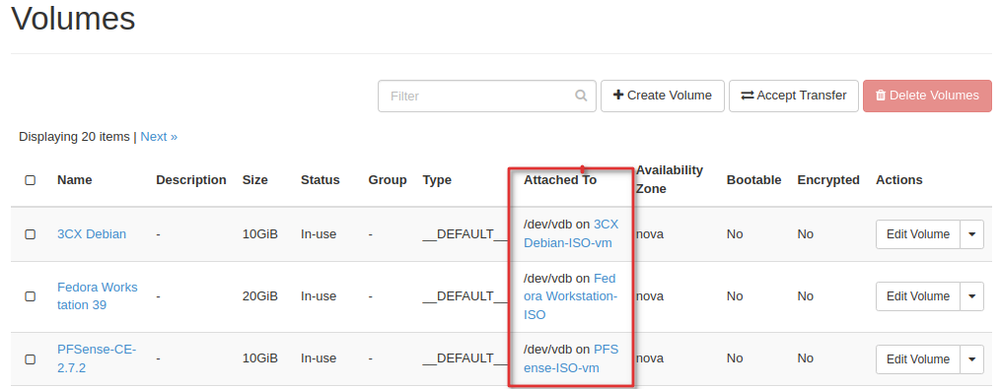

Linux OS systems have autodetection of media, but it is unlikely that the ISOs
do, go ahead and trigger a Hard Reboot for each of the VMs.

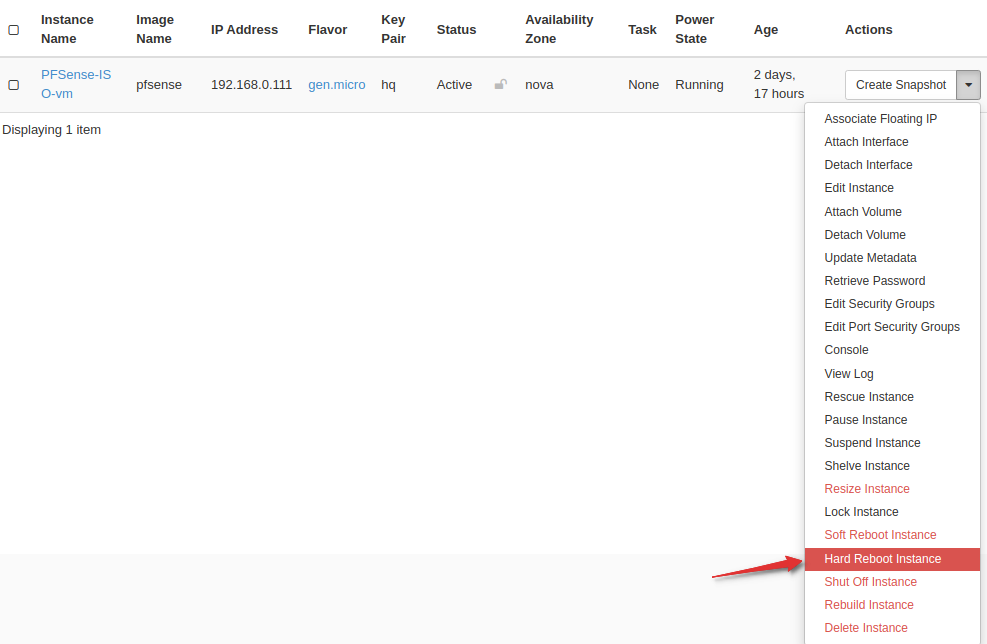

## Install Software

Now go to Console for each and proceed with the installer. You will eventually
reach “Where to install” portion of the setup media like:

_**AVOID USING FLAVORS WITH SWAP**_

Below is a link to documentation on creating flavors.

- [Flavor management](https://openmetal.io/docs/manuals/tutorials/manage-flavors)

### PFSense

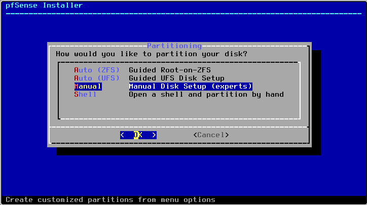

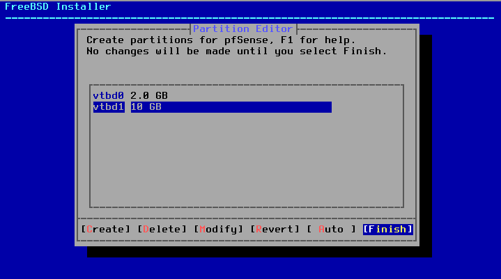

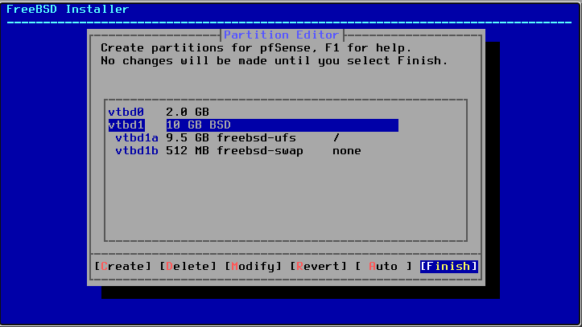

### 3CX

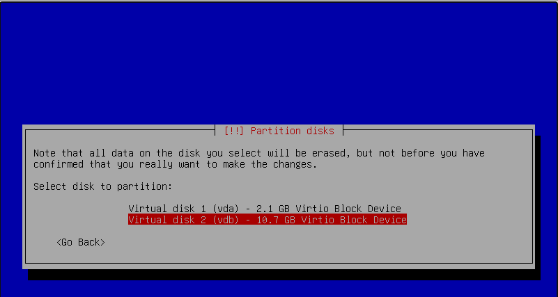

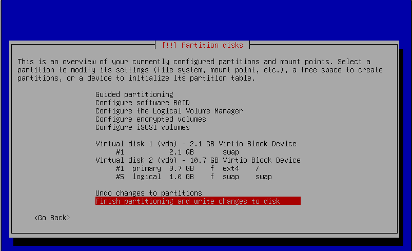

### Fedora Workstation

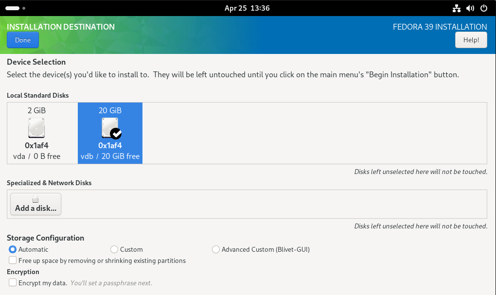

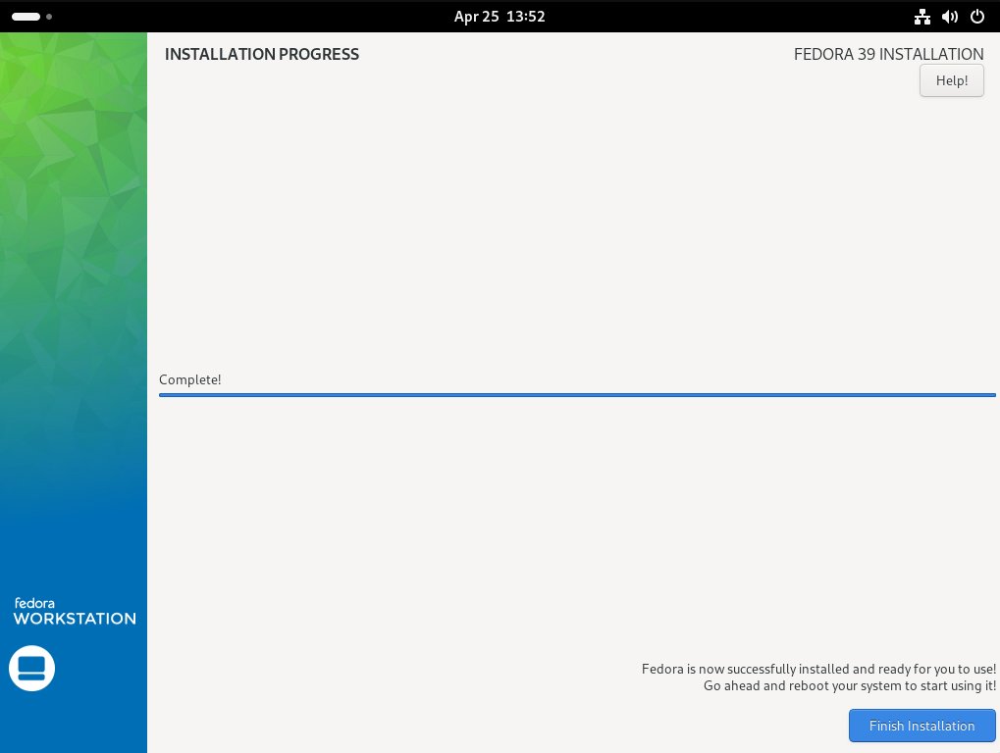

### Shut Down ISO VM

Typically once the installation completes - you will be asked to Reboot, or the
system will Reboot automatically. That is fine, however remember that rebooting
will just reboot into the ISO causing you to go through the installation menus again.

Go ahead and reboot, but go ahead and SHUT DOWN the ISO VM.
We have installed our media to the Volume.
Time to work with that directly.

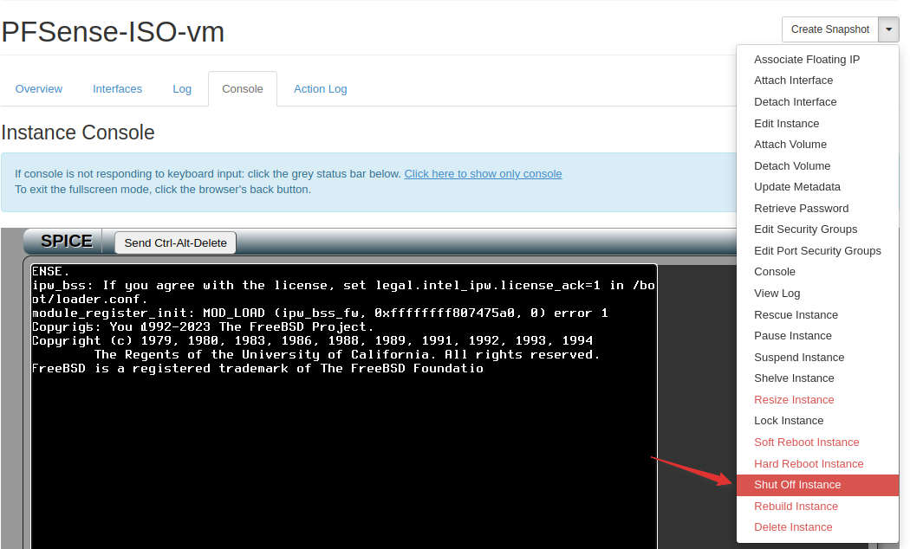

Now that the ISO instances are shut off, detached the drives we installed the
media onto.


## Detach and Configure Volumes


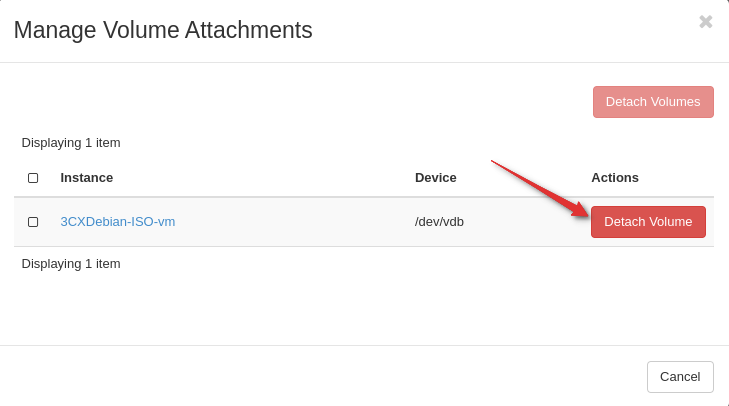

Now that we have detached our volumes, let's make them bootable.

Click Edit Volume


And check “Bootable”

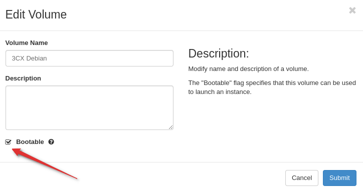

## Use / Create the VM or VM Image

You’re almost done. Now you have two options.

1. Utilize this exact volume for a VM.
2. Create a reusable Image out of this VM.

Create VM from Volume

1. To use the Volume, when creating the instance you can select
Volume (The Drive) as the Boot Source:

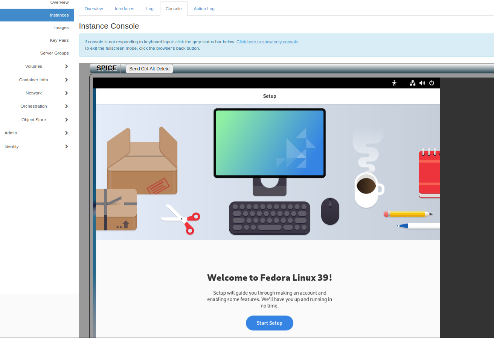

## Create Image and Provision from Image

To Create a Reusable Image upload the volume into Images


After the upload is complete, you can create VMs from that image.

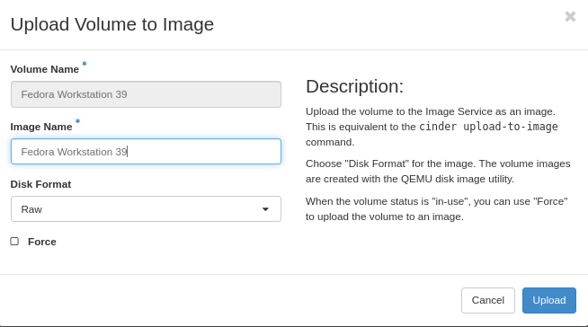


